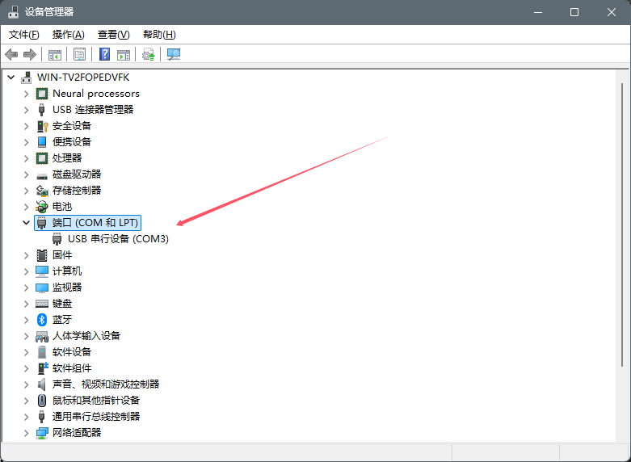
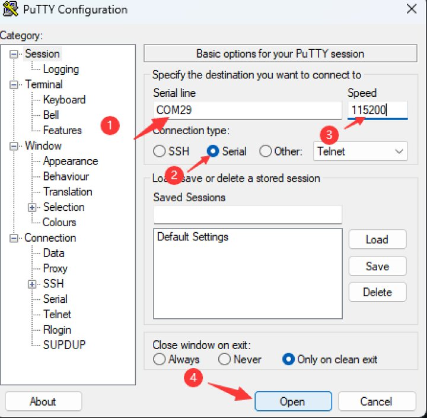
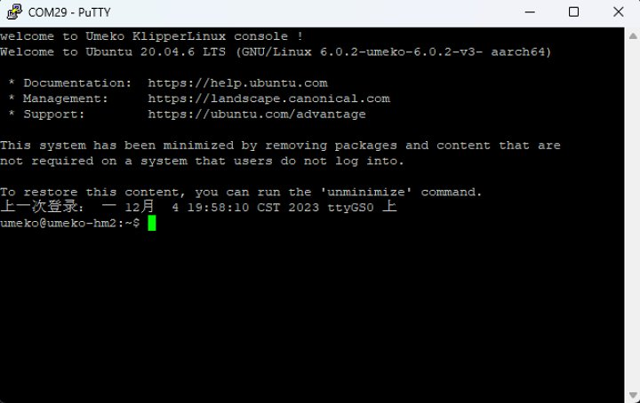
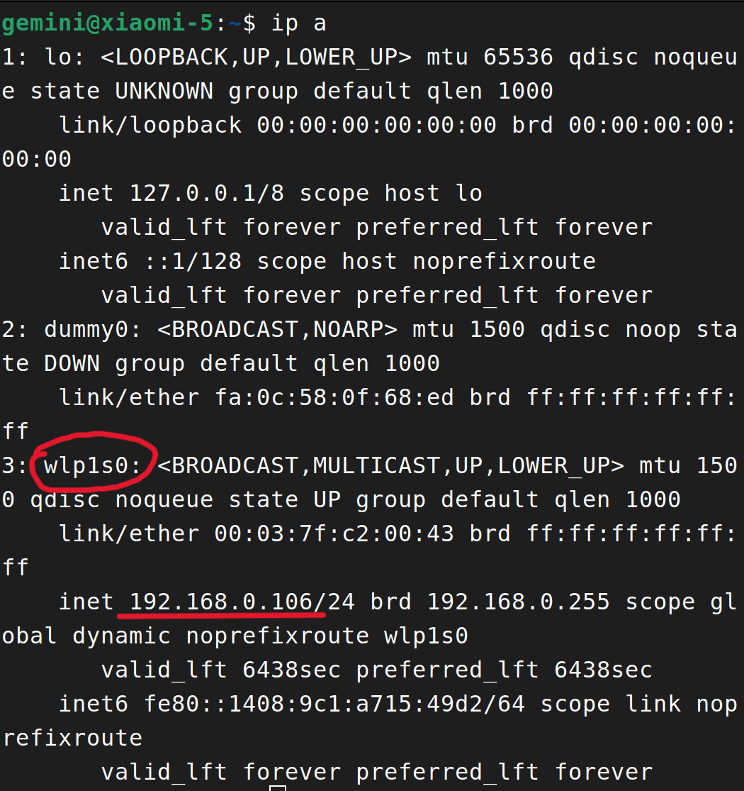
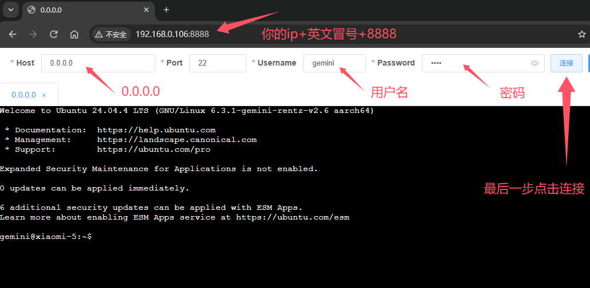

# 说明&指南

Ubuntu的用户名 `gemini` ,密码 `1234`。

---

## 1、如何连接Ubuntu？

举例两种连接到手机的方式，且不局限于这两种

### *在PC使用putty连接*

①、安装putty

```text
略
```

②、打开putty

手机使用数据线连接到电脑，可以在设备管理器看到新增的com串口设备。





如图二标注步骤操作即可连接Ubuntu，注意COM端口需要填写你在设备管理器看到的，如图一为`COM3`则填写`COM3`。



Putty终端示例如图。

---

### *在任意PC/手机的浏览器使用webssh连接*

将你的设备与Ubuntu连接到同一局域网(同一网络)，在Ubuntu打开终端，执行：

```bash
ip a
```

找到名称为`wlp1s0`的就是你的网卡，记住下方的ip地址。



打开浏览器，输入ip:8888回车即可打开webssh，接着如图输入host、port、username、password，点击连接皆可。



---

## 2、如何使用otg功能？

关闭串口连接功能以使用otg:

```bash
sudo systemctl disable serial-getty@ttyGS0.service
```

> 关闭后，将导致无法使用putty连接到Ubuntu。

开启串口连接：

```bash
sudo systemctl enable serial-getty@ttyGS0.service
```

---

## 3、无法充电？

一般为充电器协议识别问题，换非快充头，或者换智能快充头即可。

## 4、关于WIFI

刚开机不会第一时间加载网卡驱动，故需等待约1分钟才能看见wifi

> 如果遇见始终没有加载出wifi，重启即可，低概率性未知原因